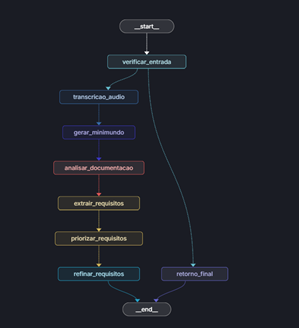

# RequirementsAI – Pipeline Inteligente de Extração de Requisitos

Este repositório demonstra um pipeline completo de extração de requisitos de software a partir de entrevistas em vídeo, utilizando modelos de linguagem natural (LLMs), LangGraph, agentes especializados e uma interface amigável em Streamlit.

A solução é composta por dois principais serviços:
- **Interface Streamlit**: permite upload de vídeos e exibição dos resultados.
- **Servidor FastAPI com LangGraph**: orquestra os agentes LLM para transcrição, análise e geração dos requisitos estruturados.

---

##  Visão Geral do Pipeline

1. Upload de um vídeo de entrevista (MKV, MP4, etc.).
2. Transcrição automatizada do áudio via LLM (Gemini/OpenAI).
3. Geração de um minimundo a partir da transcrição.
4. Análise e classificação dos requisitos:
   - Requisitos Funcionais (RF)
   - Regras de Negócio (RN)
   - Requisitos Não Funcionais (RNF)
5. Agentes refinam, validam e organizam os dados.
6. Resultado final: Markdown com três tabelas resultantes.

## Representação gráfica



---

## 📂 Estrutura de Pastas

```
.
├── streamlit_app/             # Interface do usuário
│   ├── app_streamlit.py       # App principal
│   ├── dockerfile             # Dockerfile da interface
│   └── requirements.txt     # Dependências
│
├── webhook_server/           # Backend com FastAPI + LangGraph
│   ├── main.py                # Entrypoint do servidor
│   ├── webhook_server.py     # Inicializa o LangGraph via endpoint
│   ├── graph.py              # Definição dos nós do grafo
│   ├── state.py              # Definição do estado compartilhado
│   ├── agents/               # Agentes especializados por tarefa
│   └── dockerfile            # Dockerfile do backend
│
├── shared/uploads/           # Uploads de vídeo e transcrições
├── docker-compose.yml        # Executa Streamlit + FastAPI juntos
└── README.md
```

---

## Executando o Projeto

### Requisitos (para execução local):
- Python 3.12+
- [Poetry](https://python-poetry.org/) ou `pip`
- API key do Gemini (`GEMINI_API_KEY`) ou OpenAI

## Configurando o projeto

1. **Clone o repositório e acesse a pasta:**

```bash
git clone https://github.com/profmoisesomena/RequirementsAI.git
cd RequirementsAI
```

2. **Configure variáveis de ambiente:**

```bash
cp webhook_server/.env.example webhook_server/.env
```

Edite o `.env` e informe:
- `GEMINI_API_KEY` (obrigatório)
- `LANGSMITH_API_KEY`, `LANGSMITH_PROJECT`, `LANGSMITH_TRACING` (opcional)

## Criando ambiente virtual

```bash
python3.12 -m venv venv
source venv/bin/activate  # ou venv\Scripts\activate no Windows
```

### Usando Docker Compose

```bash
docker-compose up --build
```
- O Streamlit será acessado em http://localhost:8501
- O backend FastAPI funciona internamente (porta 8001), sem exposição direta


### Execução Manual

### Backend (FastAPI):


Acesse a pasta webhook_server e execute a instrução python3 webhook_server.py
```bash
cd webhook_server
pip install -r requirements.txt (and  pip install -U "langgraph-cli[inmem]" para langgraph dev)
python3 webhook_server.py
```

### Frontend (Streamlit):
Abra um novo terminal e acesse a pasta pasta streamlit_app e execute a instrução streamlit run app_streamlit.py
```bash
cd streamlit_app
pip install -r requirements.txt
# Ajuste o app_streamlit.py para usar "http://localhost:8001 ou via docker"
streamlit run app_streamlit.py --server.port=8501
```

Agora acesse: http://localhost:8501  e você verá o Stremlit executando no seu ambiente local.

O backend FastAPI funcionará em http://localhost:8001


A resposta virá em formato Markdown com os requisitos extraídos. O Markdown final é salvo como `report_YYYYMMDD_HHMMSS.md`.


---

##  Agentes e Componentes

| Agente                  | Função Principal                                 |
|------------------------|--------------------------------------------------|
| `agent_transcricao`    | Transcrever áudio/vídeo                          |
| `agent_minimundo`      | Gerar visão textual de contexto (minimundo)       |
| `agent_analise`        | Analisar o minimundo e gerar requisitos          |
| `agent_refinamento`    | Refinar e classificar requisitos (RF, RN, RNF)   |
| `agent_validacao`      | Validar e estruturar a resposta final em Markdown |

Todos os agentes são organizados via LangGraph no arquivo `graph.py`, respeitando transições de estado e permitindo rastreabilidade com `@traceable` do LangSmith.


---

## Arquivos de Entrada (audio ou vídeo)

- `shared/uploads/*.mkv` – Vídeos de entrevista
- `*.wav`, `*.mp3` – Áudio da entrvista

---

## Referências
- [LangGraph](https://langchain-ai.github.io/langgraph/)
- [Gemini API](https://ai.google.dev/)
- [LangSmith Traceable](https://docs.smith.langchain.com/)
- [Streamlit](https://streamlit.io/)
- [FastAPI](https://fastapi.tiangolo.com/)

---

## Contribuição
Pull requests são bem-vindos! Para problemas ou sugestões, abra uma _issue_.

---

