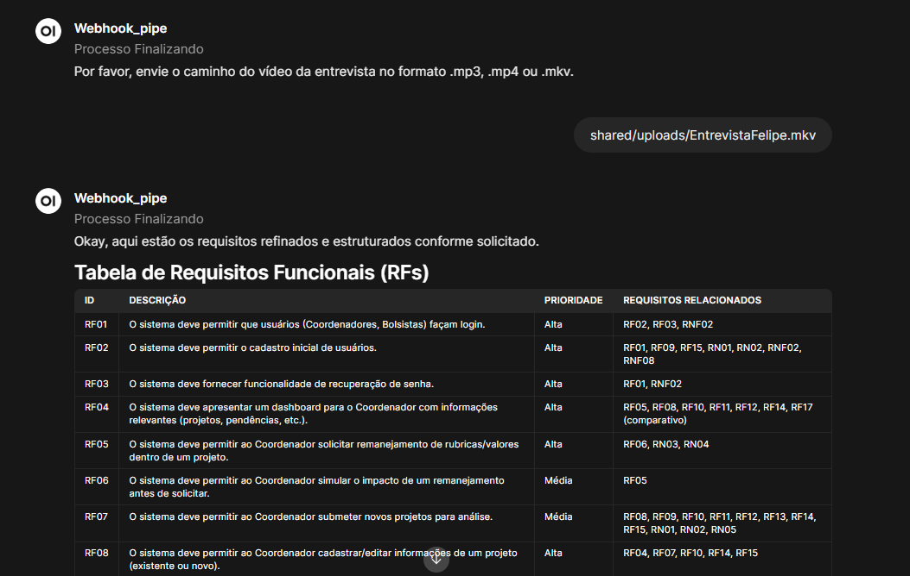

# RequirementsAI – Pipeline de Agentes com Interface Streamlit para extração de Requisitos

Este repositório contém um exemplo de pipeline de **levantamento de requisitos** utilizando a biblioteca **LangGraph** e modelos de linguagem. O projeto permite **transcrever entrevistas em vídeo** e, a partir da transcrição, **extrair requisitos de software** (funcionais, regras de negócio e não funcionais) de forma automatizada com IA. 

Esta versão do projeto introduz uma interface web interativa usando **Streamlit** para facilitar o envio de vídeos e a visualização dos resultados, bem como uma arquitetura baseada em **FastAPI** para o backend do agente. A aplicação pode ser executada via **Docker Compose** (com dois serviços: um para a interface Streamlit e outro para o servidor FastAPI) ou localmente em ambiente Python.

## Índice

- [Visão Geral](#visão-geral)
- [Estrutura de Pastas](#estrutura-de-pastas)
- [Configuração com Docker](#configuração-com-docker)
- [Serviços](#serviços)
- [Fluxos de Uso](#fluxos-de-uso)
- [Execução Local](#execução-local)

Visão Geral

O projeto exemplifica como agentes de IA podem auxiliar no levantamento de requisitos de software a partir de entrevistas gravadas. A aplicação realiza, de forma automatizada, as seguintes etapas:

1. Transcrição de Áudio/Vídeo: utiliza a API do Google Cloud (modelo Gemini) para transcrever o áudio do vídeo enviado pelo usuário. A transcrição é salva em texto e servirá de base para as próximas etapas.
2. Geração de "Minimundo": a partir da transcrição, o agente gera um minimundo, que é um resumo contextual ou descrição do domínio do problema, extraindo informações relevantes do diálogo.
3. Análise e Rascunho de Requisitos: o minimundo é analisado por um agente especialista em engenharia de requisitos (LLM) que identifica Requisitos Funcionais (RF), Regras de Negócio (RN) e Requisitos Não Funcionais (RNF), produzindo um rascunho preliminar de requisitos.
4. Extração Estruturada de Requisitos: com base nesse rascunho, o agente gera tabelas estruturadas em Markdown separando RFs, RNs e RNFs, incluindo identificadores e prioridades iniciais.
5. Priorização de Requisitos: o agente revê as tabelas geradas, ajusta/valida as prioridades (Alta, Média, Baixa) e aponta possíveis lacunas ou questões em aberto que precisam de clarificação.
6. Refinamento e Relatório Final: os requisitos são refinados em uma versão final e compilados em um relatório em formato Markdown, incluindo as tabelas finais e uma seção de dúvidas ou pontos para validação com stakeholders.

A resposta final do agente é exibida diretamente na interface Streamlit para o usuário. Além disso, o relatório final é salvo em um arquivo Markdown (no formato report_YYYYMMDD_HHMMSS.md) no servidor.

## Grafo de Estados do projeto


Um exemplo de entrevista (EntrevistaFelipe.mkv e sua transcrição EntrevistaFelipe_transcricao.txt) é incluído em shared/uploads para demonstrar o funcionamento do agente de requisitos. Já o arquivo report_20250421_172831.md é o exemplo de um report de resultado obtido com base na entrevista.

---
## Estrutura de Pastas/Projeto
A estrutura do repositório foi organizada para separar a interface do usuário (frontend) dos agentes inteligentes (backend), facilitando o desenvolvimento e implantação com Docker.


```
├── docker-compose.yml              # Arquivo Docker Compose para orquestrar os serviços
├── streamlit_app/                  # Aplicação Streamlit (frontend)
│   ├── app_streamlit.py            # Código principal da interface Streamlit (upload de vídeo e display do resultado)
│   ├── Dockerfile                  # Dockerfile para construir a imagem do serviço Streamlit
│   └── requirements.txt            # Dependências Python do Streamlit (streamlit, requests, etc.)
├── webhook_server/                 # Servidor FastAPI com a lógica do agente (backend)
│   ├── webhook_server.py           # Aplicação FastAPI definindo endpoints e integração com o pipeline LangGraph
│   ├── graph.py                    # Definição do grafo de estados (pipeline de requisitos) usando LangGraph
│   ├── langgraph.json              # Configuração do LangGraph (define grafo padrão e dependências)
│   ├── Dockerfile                  # Dockerfile para construir a imagem do serviço FastAPI
│   ├── requirements.txt            # Dependências Python do backend (FastAPI, LangGraph, Google API, etc.)
│   ├── .env.example                # Exemplo de arquivo de configuração de variáveis de ambiente (API keys, etc.)
│   ├── report_YYYYMMDD_HHMMSS.md       # Relatórios gerados pelo pipeline (formato Markdown, um novo arquivo é criado a cada execução bem-sucedida)
└── shared/
    └── uploads/                    # Diretório compartilhado (volume) para uploads de vídeo e arquivos gerados
        ├── EntrevistaFelipe.mkv            # **Exemplo:** vídeo de entrevista para teste do pipeline
        └── EntrevistaFelipe_transcricao.txt # **Exemplo:** transcrição pré-gerada do vídeo de exemplo

```

---
## Executando o projeto

1. **Clone o repositório e acesse a pasta:**

```bash
git https://github.com/profmoisesomena/langgraph_streamlit_requirements.git
cd langgraph_streamlit_requirements
```

2. **Configure variáveis de ambiente:**

```bash
cp webhook_server/.env.example webhook_server/.env
```

Edite o `.env` e informe:
- `GEMINI_API_KEY` (obrigatório)
- `LANGSMITH_API_KEY`, `LANGSMITH_PROJECT`, `LANGSMITH_TRACING` (opcional)

## Configuração Docker

3. **Suba os containers com Docker Compose:**

```bash
docker-compose up --build
```

- O Streamlit será acessado em [http://localhost:8501](http://localhost:8501)
- O backend FastAPI funciona internamente (porta 8001), sem exposição direta

## Uso da Interface Web

- Acesse a página e envie um vídeo `.mp4`, `.mkv` ou `.mp3`
- Clique em "Enviar para análise"
- O backend processará o vídeo com
  - Transcrição via Gemini
  - Geração de minimundo
  - Extração e categorização de requisitos
- O resultado será exibido na tela e salvo como `report_YYYYMMDD_HHMMSS.md`

## Execução Local (sem Docker)

### Backend (FastAPI):

```bash

python3.12 -m venv venv
source venv/bin/activate  # ou venv\Scripts\activate no Windows

```
## Execução direta

Acesse a pasta webhook_server e execute a instrução python3 webhook_server.py
```bash
cd webhook_server
pip install -r requirements.txt (and  pip install -U "langgraph-cli[inmem]" para langgraph dev)
python3 webhook_server.py
```

### Frontend (Streamlit):
Abra um novo terminal e acesse a pasta pasta streamlit_app e execute a instrução streamlit run app_streamlit.py
```bash
cd streamlit_app
pip install -r requirements.txt
# Ajuste o app_streamlit.py para usar "http://localhost:8001 ou via docker"
streamlit run app_streamlit.py --server.port=8501
```

Agora acesse: http://localhost:8501  e você verá o Stremlit executando no seu ambiente local.

O backend FastAPI funcionará em http://localhost:8001


A resposta virá em formato Markdown com os requisitos extraídos.

---

Também é possível passar o arquivo via Open WebUI, mas é necessário inserir o aquivo na pasta shared/uploads/ e indicar via webui o caminho do arquivo.



...
 Sinta-se à vontade para contribuir com melhorias, relatar *issues* ou utilizar este projeto! Boa exploração 🙂.
