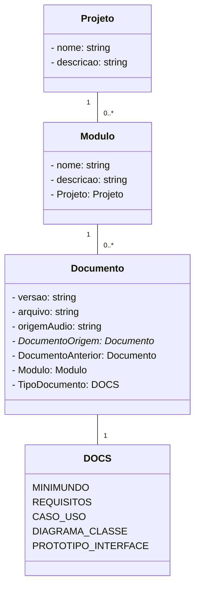

# RAI Architecture

## Backend
Python Django MVC

### Model
- Projeto
- Modulo
- Documentos (Minimundo, Tabelas de Requisitos, Documento de Casos de Uso, Diagrama de Classes, Protótipo de Interface)

### CRUD
- CRUD de Projeto

    - Cria, atualiza e deleta projetos do banco. Lê e lista projetos listando os módulos de cada projeto junto com as demais informações do projeto.

- CRUD de Modulo
    - Cria, atualiza e deleta módulos do banco. Lê e lista módulos listando os documentos de cada projeto junto com as demais informações do módulo.

- CRUD dos Documentos
    - Cria documentos com o texto que foi passado ou com base nos documentos relacionados (usando os agentes do RAI). Lê, atualiza, deleta e lista documentos do banco.
    - Usa um enum para definir os tipos dos documentos

## Diagrama de Classes de Domínio

## Frontend
TypeScript (Vue + Tailwind), Conecta Architecture

Reflete o Backend
Exibe os documentos gerados e permite a geração e atualização dos documentos gerados