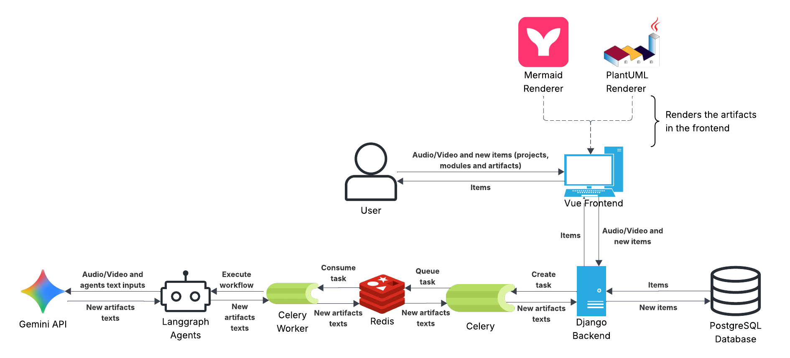

# Architecture Overview

Requirement AssIstant (RAI) is a web-based platform that automates the generation of Requirements Engineering (RE) artifacts using Large Language Model (LLM)-based agents.

The system is organized into four main architectural layers:

* **Frontend** – Provides the user interface for project management, artifact visualization, and interaction with the generation workflow.
* **Backend** – Exposes the REST API, manages projects and artifacts, and coordinates the application workflow.
* **Asynchronous Processing Layer** – Executes long-running artifact generation tasks in the background.
* **Intelligence Layer** – Orchestrates specialized LLM agents responsible for generating Requirements Engineering artifacts.

---

# Technology Stack

| Layer                   | Technologies                        |
| ----------------------- | ----------------------------------- |
| Frontend                | Vue.js, Tailwind CSS                |
| Backend                 | Django, Django ORM                  |
| Database                | PostgreSQL                          |
| Asynchronous Processing | Celery, Redis                       |
| Intelligence Layer      | LangGraph, LangChain, Google Gemini |
| Authentication          | OAuth2                              |
| API Documentation       | OpenAPI (Swagger)                   |
| Diagram Formats         | Mermaid, PlantUML                   |
| Text Format             | Markdown                            |

---

# Frontend

The frontend is implemented using **Vue.js** and **Tailwind CSS**, following a Model–View–Controller (MVC) architecture.

Its responsibilities include:

* User authentication
* Project and module management
* Uploading audio and video files
* Viewing generated artifacts
* Editing artifact contents
* Managing artifact versions and traceability

Artifacts are represented using plain-text formats:

* **Markdown** for textual artifacts
* **Mermaid** for class diagrams
* **PlantUML** for use case diagrams

These formats allow the artifacts to be processed directly by the LLM agents while remaining easy to visualize and edit through the web interface.

---

# Backend

The backend is implemented using **Django** and exposes a REST API consumed by the frontend.

Its main responsibilities are:

* Managing projects, modules, and artifacts
* Persisting application data
* Validating user requests
* Coordinating artifact generation workflows
* Dispatching asynchronous generation jobs
* Invoking the intelligence layer

The backend also provides:

* OAuth2 authentication
* CORS protection
* OpenAPI (Swagger) documentation
* Database access through the Django ORM

---

# Asynchronous Processing

Generating Requirements Engineering artifacts may involve multiple LLM calls and long-running workflows.

To avoid blocking HTTP requests and improve the user experience, RAI performs artifact generation asynchronously.

The asynchronous processing layer consists of:

* **Celery**, responsible for executing background tasks.
* **Redis**, used as both the message broker and result backend.

When a user requests the generation of an artifact:

1. The frontend sends the request to the backend.
2. The backend validates the request and creates a background task.
3. Celery retrieves the task from Redis.
4. The corresponding LangGraph workflow is executed.
5. Generated artifacts are stored in the database.
6. The frontend can monitor the task status and display the generated results once processing is complete.

This architecture allows the platform to process computationally intensive workflows without blocking user interactions.

---

# Intelligence Layer

The intelligence layer is responsible for automatically generating Requirements Engineering artifacts.

It is implemented using **LangGraph** and **LangChain**, which orchestrate multiple specialized LLM agents into execution graphs.

Each workflow is composed of specialized agents responsible for tasks such as:

* Information extraction
* Domain understanding
* Requirements analysis
* Artifact validation
* Artifact generation

The Django backend communicates with the intelligence layer through a graph invocation interface, which abstracts the internal implementation of the generation workflows.

The current implementation uses **Google Gemini** as the underlying Large Language Model. The architecture is modular, allowing other LLM providers to be integrated with minimal implementation effort.

---

# Related Documentation

The following pages describe each architectural component in greater detail:

* **Pipeline Overview** – Describes the artifact generation workflow.
* **Workflow Graph** – Presents the execution graphs used by the intelligence layer.
* **Agents and Components** – Describes the specialized agents and their responsibilities.
* **Folder Structure** – Explains the organization of the project source code.
