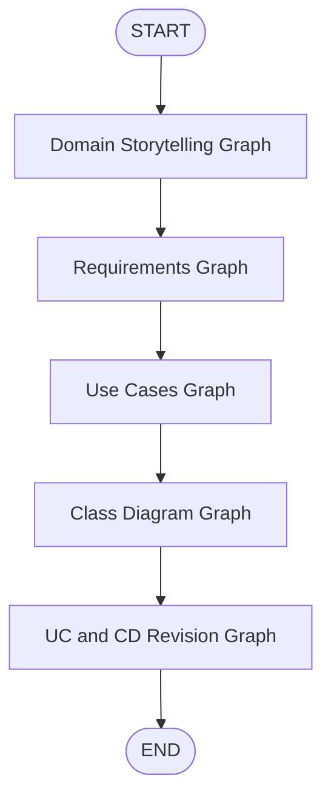

# Workflow Graph

Requirement AssIstant (RAI) organizes its LLM agents into independent LangGraph workflows. Each workflow is responsible for generating a specific Requirements Engineering artifact.

Rather than implementing a single monolithic graph, RAI separates the generation process into multiple specialized graphs. This modular design improves maintainability, extensibility, and allows individual workflows to evolve independently.

---

# Workflow Organization

The current implementation is composed of four independent workflows:

| Workflow                | Input                                                 | Output                                     |
| ----------------------- | ----------------------------------------------------- | ------------------------------------------ |
| **Domain Storytelling** | Audio or video                                        | Domain Storytelling                        |
| **Requirements**        | Domain Storytelling                                   | Requirements                               |
| **Use Cases**           | Domain Storytelling, Requirements                     | Use Case Description, Table and Diagram    |
| **Class Diagram**       | Domain Storytelling, Requirements, Use Cases          | Class Diagram                              |
| **UC and CD Revision**  | Requirements, Use Cases and Class Diagram             | Revised Use Cases and Class Diagram        |

Each workflow is implemented as an independent LangGraph graph composed of multiple specialized LLM agents.

---

# Internal Graph Structure

Although each workflow performs a different task, they all follow the same execution model.

A workflow is composed of:

* A shared graph state.
* Multiple specialized agent nodes.
* Directed edges defining the execution order.
* A final node responsible for returning the generated artifact.

This architecture allows individual agents to focus on specific responsibilities while LangGraph coordinates the overall execution.

---

# Benefits

Separating the generation pipeline into multiple LangGraph workflows provides several advantages:

* Independent development of each workflow.
* Easier maintenance and testing.
* Reuse of specialized agents.
* Simpler debugging.
* Flexibility to introduce new artifact generation workflows without affecting existing ones.
