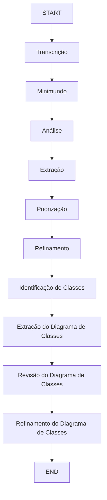

# Agentes da Criação dos Diagramas de Classe

## Linha do Tempo do Fluxo dos Agentes

| Tempo | Requirements | Class Diagram                      |
|-------|--------------|------------------------------------|
| T1    | Transcrição  | ---                                |
| T2    | Minimundo    | ---                                |
| T3    | Análise      | ---                                |
| T4    | Extração     | ---                                |
| T5    | Priorização  | ---                                |
| T6    | Refinamento  | ---                                |
| T7    | ---          | Identificação de Classes           |
| T8    | ---          | Extração do Diagrama de Classes    |
| T9    | ---          | Revisão do Diagrama de Classes     |
| T10   | ---          | Refinamento do Diagrama de Classes |

---

## Gráfico da Linha do Tempo do Fluxo dos Agentes

---

## Agentes

### Transcrição
Responsável por converter a gravação da reunião em texto estruturado, servindo como base para a modelagem inicial do sistema.

---

### Minimundo
Gera uma descrição textual formalizada do domínio do sistema (minimundo), sintetizando as informações extraídas da transcrição.

---

### Análise  
Realiza uma análise do minimundo com foco em engenharia de requisitos, identificando e classificando Requisitos Funcionais (FRs), Regras de Negócio (BRs) e Requisitos Não Funcionais (NFRs). Aponta lacunas e inconsistências no texto e propõe perguntas de esclarecimento ou suposições bem fundamentadas.

---

### Extração  
Estrutura os requisitos identificados em tabelas organizadas por tipo (funcionais, regras de negócio e não funcionais), atribuindo prioridade e relacionamentos entre eles. Utiliza formatação Markdown para padronização e clareza, e registra dúvidas sobre possíveis lacunas ou inconsistências ao final.

---

### Priorização  
Avalia a coerência das prioridades atribuídas aos requisitos (Alta, Média, Baixa), sugerindo ajustes quando necessário. Identifica lacunas ou informações ambíguas e formula perguntas para esclarecimento, preparando os requisitos para a etapa final de refinamento.

---

### Refinamento  
Gera a versão final dos requisitos priorizados, organizando-os em três tabelas (Requisitos Funcionais, Regras de Negócio e Requisitos Não Funcionais) em formato Markdown. Inclui, ao final, questões pendentes e observações finais para o usuário, garantindo clareza e consistência.

---

### Identificação de Classes
Analisa o minimundo para extrair as entidades principais do sistema, identificando classes, atributos e relações, baseando-se nos princípios da modelagem orientada a objetos.

---

### Extração do Diagrama de Classes
Cria uma primeira versão do diagrama de classes a partir da lista de classes, atributos e relações previamente identificados na análise do minimundo.

---

### Revisão do Diagrama de Classes
Reavalia o diagrama, alinhando-o com os requisitos funcionais, regras de negócio e requisitos não funcionais, corrigindo possíveis inconsistências, lacunas ou erros semânticos.

---

### Refinamento do Diagrama de Classes
Realiza o aprimoramento final do diagrama, garantindo alinhamento semântico, consistência técnica e conformidade com os padrões de modelagem adotados.

---