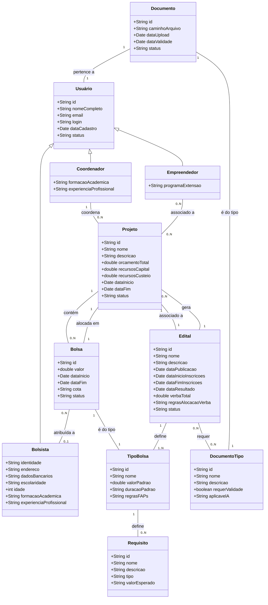

```mermaid
classDiagram
    class Usuário{
        +String id
        +String nomeCompleto
        +String email
        +String login
        +Date dataCadastro
        +String status
    }
    
    class Coordenador{
        +String formacaoAcademica
        +String experienciaProfissional
    }
    
    class Bolsista{
        +String identidade
        +String endereco
        +String dadosBancarios
        +String escolaridade
        +int idade
        +String formacaoAcademica
        +String experienciaProfissional
    }
    
    class Empreendedor{
        +String programaExtensao
    }
    
    class Edital{
        +String id
        +String nome
        +String descricao
        +Date dataPublicacao
        +Date dataInicioInscricoes
        +Date dataFimInscricoes
        +Date dataResultado
        +double verbaTotal
        +String regrasAlocacaoVerba
        +String status
    }
    
    class Projeto{
        +String id
        +String nome
        +String descricao
        +double orcamentoTotal
        +double recursosCapital
        +double recursosCusteio
        +Date dataInicio
        +Date dataFim
        +String status
    }
    
    class Bolsa{
        +String id
        +double valor
        +Date dataInicio
        +Date dataFim
        +String cota
        +String status
    }
    
    class TipoBolsa{
        +String id
        +String nome
        +double valorPadrao
        +String duracaoPadrao
        +String regrasFAPs
    }
    
    class Requisito{
        +String id
        +String nome
        +String descricao
        +String tipo
        +String valorEsperado
    }
    
    class DocumentoTipo{
        +String id
        +String nome
        +String descricao
        +boolean requerValidade
        +String aplicavelA
    }
    
    class Documento{
        +String id
        +String caminhoArquivo
        +Date dataUpload
        +Date dataValidade
        +String status
    }

    Usuário <|-- Coordenador
    Usuário <|-- Bolsista
    Usuário <|-- Empreendedor

    Coordenador "1" -- "0..N" Projeto : coordena
    Projeto "1" -- "1" Edital : associado a
    Projeto "1" -- "0..N" Bolsa : contém

    Bolsa "0..N" -- "0..1" Bolsista : atribuída a
    Bolsa "1" -- "1" TipoBolsa : é do tipo
    Bolsa "1" -- "1" Projeto : alocada em

    Edital "1" -- "1..N" TipoBolsa : define
    Edital "1" -- "0..N" Projeto : gera
    Edital "0..N" -- "0..N" DocumentoTipo : requer

    TipoBolsa "1" -- "0..N" Requisito : define

    Documento "1" -- "1" DocumentoTipo : é do tipo
    Documento "1" -- "1" Usuário : pertence a

    Empreendedor "0..N" -- "0..N" Projeto : associado a
```