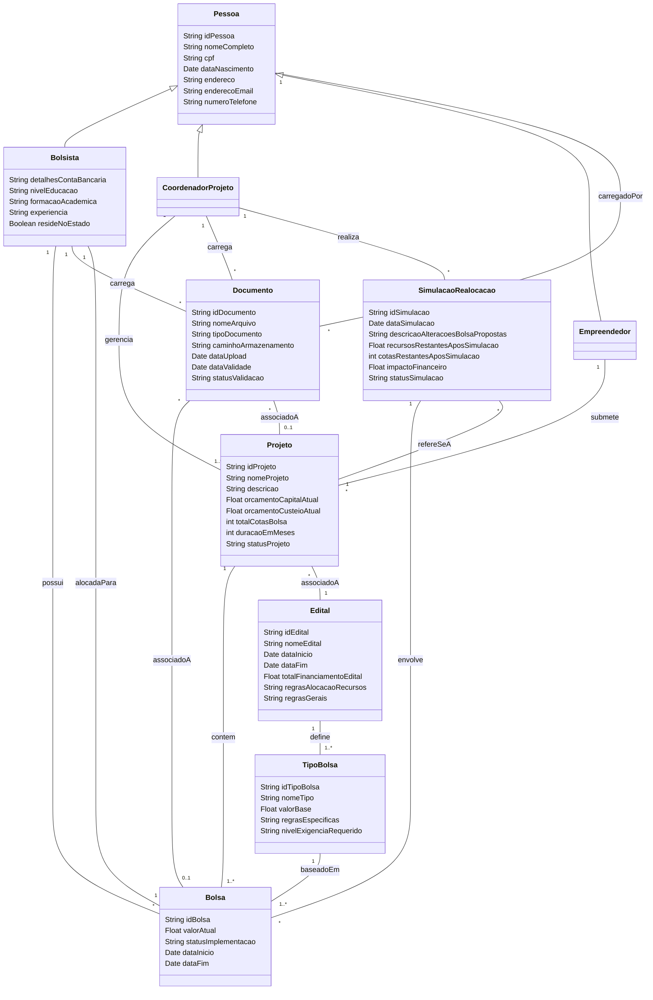

## Diagrama de Classes

## Dicionário de Dados

### Pessoa
| Atributo | Descrição |
|---|---|
| `idPessoa` | Identificador único para a pessoa. |
| `nomeCompleto` | Nome completo da pessoa. |
| `cpf` | Cadastro de Pessoa Física (identificação fiscal brasileira). |
| `dataNascimento` | Data de nascimento da pessoa. |
| `endereco` | Endereço completo da pessoa. |
| `enderecoEmail` | Endereço de e-mail da pessoa. |
| `numeroTelefone` | Número de telefone da pessoa. |

### Bolsista
| Atributo | Descrição |
|---|---|
| `detalhesContaBancaria` | Detalhes da conta bancária para pagamentos de bolsa. |
| `nivelEducacao` | Nível de escolaridade (ex: "Ensino Médio", "Graduação", "Pós-Graduação"). |
| `formacaoAcademica` | Formação acadêmica ou área de estudo. |
| `experiencia` | Experiência profissional ou acadêmica relevante para a bolsa. |
| `resideNoEstado` | Booleano indicando se o bolsista reside no estado, um requisito para elegibilidade (BR007). |

### CoordenadorProjeto
| Atributo | Descrição |
|---|---|
| (Herda de Pessoa) | |

### Empreendedor
| Atributo | Descrição |
|---|---|
| (Herda de Pessoa) | |

### Projeto
| Atributo | Descrição |
|---|---|
| `idProjeto` | Identificador único para o projeto. |
| `nomeProjeto` | Nome do projeto. |
| `descricao` | Descrição detalhada do projeto. |
| `orcamentoCapitalAtual` | Orçamento de capital alocado atualmente para o projeto (FR005). |
| `orcamentoCusteioAtual` | Orçamento de custeio alocado atualmente para o projeto (FR005). |
| `totalCotasBolsa` | Número total de cotas de bolsa disponíveis para o projeto (FR006, BR001). |
| `duracaoEmMeses` | Duração do projeto em meses (FR007). |
| `statusProjeto` | Status atual do projeto (ex: "Submetido", "Aprovado", "Em Andamento", "Concluído", "Cancelado"). |

### Edital
| Atributo | Descrição |
|---|---|
| `idEdital` | Identificador único para o edital. |
| `nomeEdital` | Nome do edital. |
| `dataInicio` | Data de início da validade do edital. |
| `dataFim` | Data de término da validade do edital. |
| `totalFinanciamentoEdital` | Financiamento total disponível para o edital. |
| `regrasAlocacaoRecursos` | Regras para alocação de recursos definidas pelo edital. |
| `regrasGerais` | Regras gerais definidas pelo edital. |

### TipoBolsa
| Atributo | Descrição |
|---|---|
| `idTipoBolsa` | Identificador único para o tipo de bolsa. |
| `nomeTipo` | Nome do tipo de bolsa (ex: "IC" - Iniciação Científica, "DTI" - Desenvolvimento Tecnológico e Inovação). |
| `valorBase` | Valor monetário base deste tipo de bolsa. |
| `regrasEspecificas` | Regras específicas para este tipo de bolsa (BR002). |
| `nivelExigenciaRequerido` | Nível de exigência ou qualificações requeridas para este tipo de bolsa (BR002). |

### Bolsa
| Atributo | Descrição |
|---|---|
| `idBolsa` | Identificador único para a instância da bolsa. |
| `valorAtual` | Valor monetário atual da bolsa. |
| `statusImplementacao` | Status da implementação da bolsa (ex: "Pendente Implementação", "Implementada", "Suspensa", "Concluída", "Cancelada"). |
| `dataInicio` | Data de início da validade da bolsa. |
| `dataFim` | Data de término da validade da bolsa. |

### Documento
| Atributo | Descrição |
|---|---|
| `idDocumento` | Identificador único para o documento. |
| `nomeArquivo` | Nome do arquivo carregado. |
| `tipoDocumento` | Tipo do documento (ex: "Certidão Negativa", "Comprovante Escolaridade", "Plano de Trabalho"). |
| `caminhoArmazenamento` | Caminho ou URL onde o documento está armazenado. |
| `dataUpload` | Data em que o documento foi carregado. |
| `dataValidade` | Data de validade opcional para o documento (BR008). |
| `statusValidacao` | Status atual de validação do documento (ex: "Pendente Validação", "Validado", "Rejeitado"). |

### SimulacaoRealocacao
| Atributo | Descrição |
|---|---|
| `idSimulacao` | Identificador único para a simulação de realocação. |
| `dataSimulacao` | Data em que a simulação foi realizada. |
| `descricaoAlteracoesBolsaPropostas` | Descrição textual das alterações propostas para as bolsas dentro da simulação. |
| `recursosRestantesAposSimulacao` | Recursos financeiros restantes para o projeto após a realocação simulada. |
| `cotasRestantesAposSimulacao` | Cotas de bolsa restantes para o projeto após a realocação simulada. |
| `impactoFinanceiro` | Impacto financeiro (ex: aumento ou diminuição do valor total da bolsa) da realocação proposta. |
| `statusSimulacao` | Status da simulação (ex: "Rascunho", "Concluída", "Aplicada", "Cancelada"). |

## Perguntas

1.  **Hierarquia de Usuários/Papéis**: Uma `Pessoa` pode assumir múltiplos papéis (ex: `Bolsista`, `CoordenadorProjeto`, `Empreendedor`) simultaneamente? Se sim, como isso deveria ser modelado para permitir que um único objeto `Pessoa` detenha múltiplos papéis ativos, considerando que `Bolsista` possui atributos específicos?
2.  **Detalhes da Simulação de Realocação**:
    *   O atributo `descricaoAlteracoesBolsaPropostas` em `SimulacaoRealocacao` é uma string. Isso deveria ser um relacionamento mais estruturado, detalhando alterações propostas específicas (ex: valor, status, tipo) para cada `Bolsa` envolvida na simulação?
    *   Qual é o ciclo de vida de uma `Bolsa` quando ela é "trocada" ou afetada por uma realocação? Ela é desativada, arquivada ou excluída?
    *   As `SimulacaoRealocacao`s exigem uma etapa de aprovação explícita (ex: pela equipe da FAPES) antes que as alterações propostas sejam aplicadas às `Bolsa`s reais?
3.  **Rastreamento de Orçamento do Projeto**: Os atributos `orcamentoCapitalAtual` e `orcamentoCusteioAtual` em `Projeto` destinam-se a representar a alocação *inicial* ou o saldo *atual restante*? O sistema precisa rastrear despesas individuais, ou apenas os valores totais alocados e restantes?
4.  **Granularidade das Cotas de Bolsa**: O atributo `totalCotasBolsa` em `Projeto` é uma contagem numérica única para todos os tipos de bolsa, ou existem cotas específicas para diferentes `TipoBolsa`s (ex: 5 cotas para IC, 2 para DTI)?
5.  **Gestão de Projetos pelo Empreendedor**: Depois que um `Empreendedor` submete um `Projeto`, ele continua a gerenciá-lo como um `CoordenadorProjeto`, ou o projeto é então atribuído a um `CoordenadorProjeto` diferente?
6.  **Status de Validação de Documento**: Quais são os estados e transições específicos para o atributo `statusValidacao` de um `Documento` (ex: "Pendente Validação", "Validado", "Rejeitado")?
7.  **Status de Implementação da Bolsa**: Quais são os status específicos que uma `Bolsa` pode ter para seu atributo `statusImplementacao` (ex: "Pendente Implementação", "Implementada", "Suspensa", "Concluída", "Cancelada")?
8.  **Dados do Sistema Administrativo**: Além de `Edital`, aprovação de `Projeto` e definições de `TipoBolsa`, quais "outros dados base essenciais" são fornecidos pelo `Sistema Administrativo`? (ex: códigos internos da FAPES, unidades organizacionais, etc.)
9.  **Validação de Elegibilidade**: Como o sistema deve lidar com casos em que um `Bolsista` não atende aos requisitos de elegibilidade (ex: idade, residência, formação acadêmica) durante o registro ou a alocação da bolsa? Existem regras de validação específicas para entrada de dados (ex: formato de conta bancária, tipos de documento, campos obrigatórios)?