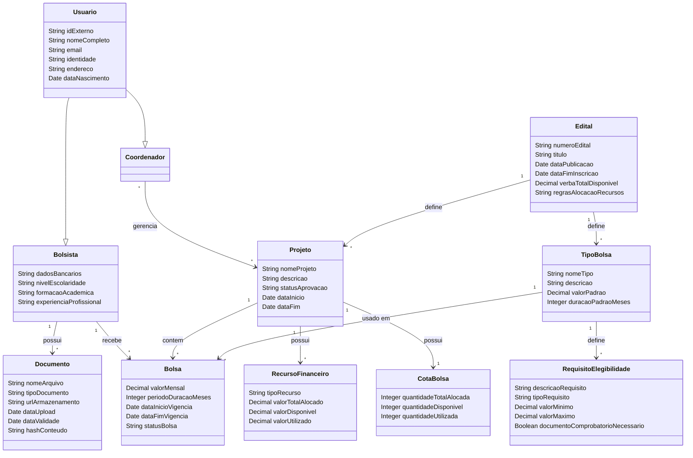

## Diagrama de Classes

## Dicionário de Dados

### Usuario
| Atributo | Descrição |
|---|---|
| `idExterno` | Identificador único do sistema externo SOU GOV. |
| `nomeCompleto` | Nome completo do usuário. |
| `email` | Endereço de e-mail do usuário. |
| `identidade` | Número do documento de identificação (ex: CPF, RG). |
| `endereco` | Endereço completo do usuário, incluindo rua, número, complemento, bairro, cidade, estado e CEP. |
| `dataNascimento` | Data de nascimento do usuário. |

### Bolsista
| Atributo | Descrição |
|---|---|
| `dadosBancarios` | Detalhes bancários do bolsista, incluindo nome do banco, agência, número da conta e tipo de conta. |
| `nivelEscolaridade` | Nível de escolaridade do bolsista. |
| `formacaoAcademica` | Formação acadêmica do bolsista. |
| `experienciaProfissional` | Experiência profissional do bolsista. |

### Coordenador
| Atributo | Descrição |
|---|---|
| (Nenhum atributo específico além dos herdados de `Usuario`) | |

### Projeto
| Atributo | Descrição |
|---|---|
| `nomeProjeto` | Nome do projeto. |
| `descricao` | Descrição do projeto. |
| `statusAprovacao` | Status atual de aprovação do projeto (ex: "Submetido", "Em Análise", "Aprovado", "Rejeitado"). |
| `dataInicio` | Data de início do projeto. |
| `dataFim` | Data de término do projeto. |

### Edital
| Atributo | Descrição |
|---|---|
| `numeroEdital` | Número de identificação único da chamada pública. |
| `titulo` | Título da chamada pública. |
| `dataPublicacao` | Data de publicação da chamada pública. |
| `dataFimInscricao` | Prazo final para inscrições ou propostas para a chamada pública. |
| `verbaTotalDisponivel` | Orçamento total disponível para alocação sob esta chamada pública. |
| `regrasAlocacaoRecursos` | Regras textuais ou estruturadas que governam a alocação de recursos. |

### Bolsa
| Atributo | Descrição |
|---|---|
| `valorMensal` | Valor mensal da bolsa. |
| `periodoDuracaoMeses` | Duração da bolsa em meses. |
| `dataInicioVigencia` | Data de início do período de vigência da bolsa. |
| `dataFimVigencia` | Data de término do período de vigência da bolsa. |
| `statusBolsa` | Status atual da bolsa (ex: "Pendente Implementação", "Ativa", "Suspensa", "Encerrada", "Remanejada"). |

### TipoBolsa
| Atributo | Descrição |
|---|---|
| `nomeTipo` | Nome do tipo de bolsa (ex: "Iniciação Científica", "Mestrado"). |
| `descricao` | Descrição do tipo de bolsa. |
| `valorPadrao` | Valor padrão opcional para bolsas deste tipo. |
| `duracaoPadraoMeses` | Duração padrão opcional em meses para bolsas deste tipo. |

### RequisitoElegibilidade
| Atributo | Descrição |
|---|---|
| `descricaoRequisito` | Descrição do requisito de elegibilidade. |
| `tipoRequisito` | Categoria do requisito (ex: "idade", "escolaridade", "documento", "residencia", "certidao"). |
| `valorMinimo` | Valor mínimo para requisitos numéricos (pode ser nulo). |
| `valorMaximo` | Valor máximo para requisitos numéricos (pode ser nulo). |
| `documentoComprobatorioNecessario` | Indica se um documento comprobatório é necessário para este critério de elegibilidade. |

### Documento
| Atributo | Descrição |
|---|---|
| `nomeArquivo` | Nome original do arquivo carregado. |
| `tipoDocumento` | Categoria ou tipo do documento (ex: "Diploma", "Comprovante de Residência", "Certidão Negativa"). |
| `urlArmazenamento` | URL ou caminho onde o arquivo do documento está armazenado. |
| `dataUpload` | Data e hora em que o documento foi carregado. |
| `dataValidade` | Data de expiração do documento (pode ser nulo). |
| `hashConteudo` | Valor hash do conteúdo do documento para verificação de integridade e unicidade. |

### RecursoFinanceiro
| Atributo | Descrição |
|---|---|
| `tipoRecurso` | Tipo de recurso financeiro (ex: "Capital", "Custeio"). |
| `valorTotalAlocado` | Valor total dos fundos alocados para este tipo de recurso. |
| `valorDisponivel` | Fundos disponíveis restantes para este tipo de recurso. |
| `valorUtilizado` | Quantidade de fundos já utilizados para este tipo de recurso. |

### CotaBolsa
| Atributo | Descrição |
|---|---|
| `quantidadeTotalAlocada` | Número total de vagas de bolsa alocadas para o projeto. |
| `quantidadeDisponivel` | Número de vagas de bolsa ainda disponíveis. |
| `quantidadeUtilizada` | Número de vagas de bolsa já utilizadas. |

## Perguntas

1.  **Papéis de Usuário (Pesquisador, Empreendedor):** O diagrama modela explicitamente apenas `Bolsista` e `Coordenador` como tipos de `Usuario`. "Pesquisador" e "Empreendedor" possuem atributos distintos, funcionalidades ou dados específicos associados a eles dentro do Portal FAPs, além de serem usuários gerais? Se sim, quais são? Ou são apenas rótulos descritivos para `Bolsista`s ou `Coordenador`s?
2.  **Regras de Remanejamento:** Quais são as regras de negócio e restrições precisas para o "Remanejamento de Bolsas"? Especificamente:
    *   Uma `Bolsa` pode ser dividida em várias novas `Bolsa`s, ou fundida a partir de várias `Bolsa`s?
    *   O que acontece com a(s) instância(s) original(is) da `Bolsa` durante um remanejamento (ex: mudança de status para "Remanejada", "Encerrada")?
    *   Existem limites para quantas vezes uma `Bolsa` pode ser remanejada?
    *   Existem tipos específicos de `Bolsa`s que não podem ser remanejadas?
3.  **Certidões Negativas:** Quais são os tipos específicos de "Certidões Negativas" exigidos para a elegibilidade do bolsista? Quais são seus períodos de validade e como são verificadas?
4.  **Fluxo de Submissão e Aprovação de Projetos:** Um `Coordenador` pode submeter uma nova proposta de `Projeto` via Portal FAPs? Se sim, quais informações são necessárias para a submissão e quais são as etapas detalhadas e os status no fluxo de aprovação do projeto (ex: "Submetido", "Em Análise", "Aprovado", "Rejeitado")?
5.  **Fluxo de Implementação de Bolsas:** Por favor, detalhe o processo passo a passo para a "Implementação de Bolsas". Quais documentos são exigidos em cada etapa e quais são os diferentes status que uma `Bolsa` pode ter durante este processo (ex: "Pendente Documentação Bolsista", "Pendente Aprovação Coordenador", "Implementada")?
6.  **Escopo de Reutilização de Documentos:** O diagrama mostra que um `Bolsista` `possui` `Documento`s. Um `Documento` carregado por um `Bolsista` pode ser reutilizado para múltiplas implementações de `Bolsa`s *diferentes* (ex: se um bolsista receber uma segunda bolsa posteriormente)? Ou a reutilização é limitada a diferentes processos *dentro da mesma aplicação de bolsa*?
7.  **Detalhes da Integração com o Sistema Interno da FAPs:**
    *   Qual é a natureza exata da integração com o "Sistema Administrativo Interno da FAPs"? É principalmente um fluxo de dados unidirecional (interno para o Portal FAPs), ou o Portal FAPs pode enviar dados de volta (ex: atualizações de status, novas implementações de `Bolsa`)?
    *   `Edital`, `Projeto` (após aprovação) e `TipoBolsa` são considerados somente leitura dentro do Portal FAPs, ou `Coordenador`s ou `Bolsista`s podem propor alterações que são então enviadas de volta para aprovação interna?
8.  **Múltiplos Coordenadores por Projeto:** O diagrama indica que um `Projeto` pode ter múltiplos `Coordenador`s, e um `Coordenador` pode gerenciar múltiplos `Projeto`s. Isso está correto? Se sim, eles possuem diferentes papéis ou permissões dentro do projeto?
9.  **Múltiplas Bolsas Ativas para Bolsista:** O diagrama permite que um `Bolsista` receba múltiplas `Bolsa`s. Um `Bolsista` pode receber e gerenciar múltiplas `Bolsa`s *ativas* simultaneamente da FAPs, potencialmente de diferentes projetos ou editais?
10. **Cardinalidade de RecursoFinanceiro:** O diagrama `Projeto "1" --> "*" RecursoFinanceiro : possui` permite múltiplas instâncias de `RecursoFinanceiro` por `Projeto`. A questão original afirmava que um `Projeto` `possui` `RecursoFinanceiro` (2, um para Capital, um para Custeio). É uma regra de negócio estrita que cada `Projeto` deve ter *exatamente duas* instâncias de `RecursoFinanceiro` (uma para "Capital" e uma para "Custeio"), ou pode ser mais ou menos?
11. **Requisitos de Elegibilidade do Bolsista:** O diagrama mostra `TipoBolsa "1" --> "*" RequisitoElegibilidade : define`. Não mostra uma relação direta e persistente entre um `Bolsista` e instâncias de `RequisitoElegibilidade`. Isso implica que a verificação de um `Bolsista` atendendo aos `RequisitoElegibilidade` é realizada durante o processo de aplicação da `Bolsa` com base nos requisitos definidos pelo `TipoBolsa`. Este entendimento está correto?
12. **Relação entre Bolsa e Documento:** O diagrama original tinha `Bolsa "*" --> "*" Documento : requer`. Esta relação foi removida, pois `Bolsista "1" --> "*" Documento : possui` já vincula documentos ao bolsista, e `TipoBolsa "1" --> "*" RequisitoElegibilidade : define` especifica *tipos* de documentos exigidos. Como o conjunto específico de instâncias de `Documento` fornecidas por um `Bolsista` é vinculado a uma aplicação ou implementação de `Bolsa` específica para satisfazer seus `RequisitoElegibilidade`s?