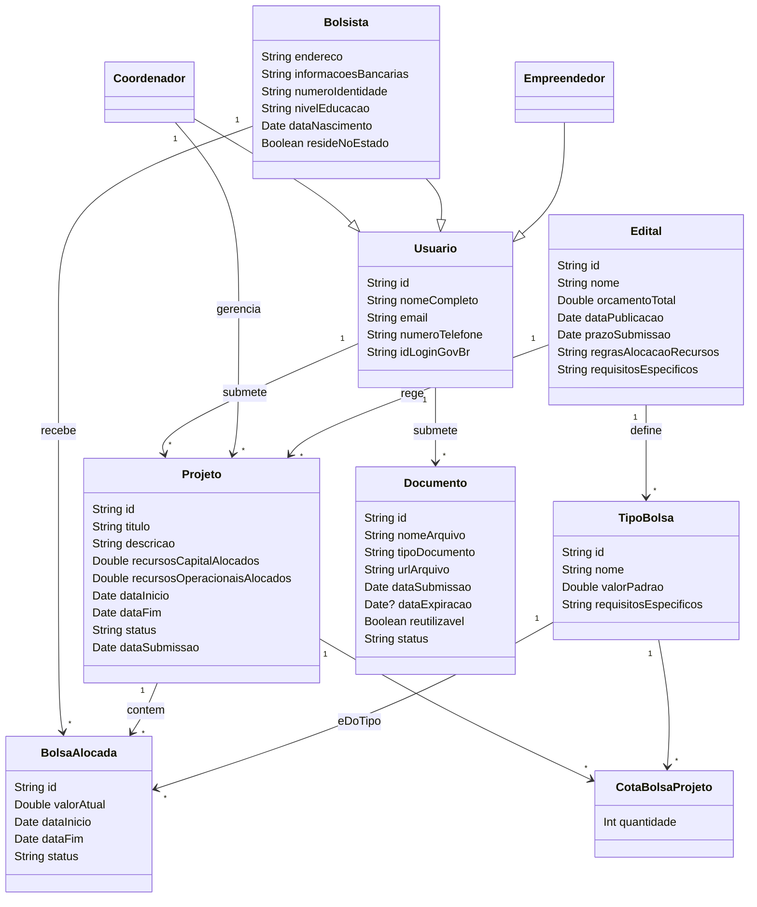

## Diagrama de Classes

## Dicionário de Dados

### Usuario
| Atributo | Descrição |
|---|---|
| id | Identificador único para o usuário. |
| nomeCompleto | Nome completo do usuário. |
| email | Endereço de e-mail do usuário. |
| numeroTelefone | Número de telefone do usuário. |
| idLoginGovBr | Identificador para autenticação via SOU GOV. |

### Coordenador
| Atributo | Descrição |
|---|---|
| (Herdado de Usuário) | |

### Bolsista
| Atributo | Descrição |
|---|---|
| endereco | Endereço completo do bolsista. |
| informacoesBancarias | Detalhes bancários (ex: nome do banco, agência, número da conta). |
| numeroIdentidade | Número do documento de identidade do bolsista. |
| nivelEducacao | Nível de educação do bolsista. |
| dataNascimento | Data de nascimento do bolsista. |
| resideNoEstado | Indica se o bolsista reside no estado. |

### Empreendedor
| Atributo | Descrição |
|---|---|
| (Herdado de Usuário) | |

### Projeto
| Atributo | Descrição |
|---|---|
| id | Identificador único para o projeto. |
| titulo | Título do projeto. |
| descricao | Descrição do projeto. |
| recursosCapitalAlocados | Valor financeiro dos recursos de capital alocados ao projeto. |
| recursosOperacionaisAlocados | Valor financeiro dos recursos de despesas correntes alocados ao projeto. |
| dataInicio | Data de início do projeto. |
| dataFim | Data de término do projeto. |
| status | Status atual do projeto (ex: "Em Avaliação", "Aprovado", "Em Execução", "Concluído"). |
| dataSubmissao | Data em que o projeto foi submetido. |

### Edital
| Atributo | Descrição |
|---|---|
| id | Identificador único para o edital. |
| nome | Nome do edital. |
| orcamentoTotal | Orçamento total disponível para o edital. |
| dataPublicacao | Data de publicação do edital. |
| prazoSubmissao | Prazo final para submissão de projetos sob este edital. |
| regrasAlocacaoRecursos | Texto descritivo das regras para alocação de recursos. |
| requisitosEspecificos | Texto descritivo dos requisitos específicos para o edital. |

### TipoBolsa
| Atributo | Descrição |
|---|---|
| id | Identificador único para o tipo de bolsa. |
| nome | Nome do tipo de bolsa (ex: "Bolsa IC", "Bolsa Mestrado"). |
| valorPadrao | Valor padrão para este tipo de bolsa. |
| requisitosEspecificos | Texto descritivo dos requisitos específicos e níveis de elegibilidade para este tipo de bolsa. |

### BolsaAlocada
| Atributo | Descrição |
|---|---|
| id | Identificador único para a instância da bolsa alocada. |
| valorAtual | Valor financeiro atual da bolsa alocada. |
| dataInicio | Data de início da bolsa alocada. |
| dataFim | Data de término da bolsa alocada. |
| status | Status atual da bolsa alocada (ex: "Ativa", "Suspensa", "Concluída", "Cancelada"). |

### Documento
| Atributo | Descrição |
|---|---|
| id | Identificador único para o documento. |
| nomeArquivo | Nome do arquivo do documento. |
| tipoDocumento | Tipo do documento (ex: "Diploma", "ComprovanteResidencia", "CertidaoNegativa"). |
| urlArquivo | Caminho ou URL onde o arquivo está armazenado. |
| dataSubmissao | Data em que o documento foi submetido. |
| dataExpiracao | Data de expiração do documento (nulo, para documentos que expiram). |
| reutilizavel | Indica se o documento pode ser reutilizado em múltiplas submissões. |
| status | Status atual do documento (ex: "Pendente", "Aprovado", "Rejeitado"). |

### CotaBolsaProjeto
| Atributo | Descrição |
|---|---|
| quantidade | O número máximo de bolsas de um tipo específico que podem ser alocadas dentro de um projeto. |

## Ciclos de Dependência

*   **Ciclo 1: Projeto <-> BolsaAlocada <-> Bolsista <-> Usuario <-> Projeto**
    *   `Projeto` contém `BolsaAlocada` (`Projeto "1" --> "*" BolsaAlocada : contem`)
    *   `Bolsista` recebe `BolsaAlocada` (`Bolsista "1" --> "*" BolsaAlocada : recebe`)
    *   `Bolsista` é um `Usuario` (`Bolsista --|> Usuario`)
    *   `Usuario` submete `Projeto` (`Usuario "1" --> "*" Projeto : submete`)

*   **Ciclo 2: Projeto <-> CotaBolsaProjeto <-> TipoBolsa <-> Edital <-> Projeto**
    *   `Projeto` tem `CotaBolsaProjeto` (`Projeto "1" --> "*" CotaBolsaProjeto`)
    *   `CotaBolsaProjeto` está associada a um `TipoBolsa` (`TipoBolsa "1" --> "*" CotaBolsaProjeto`)
    *   `Edital` define `TipoBolsa` (`Edital "1" --> "*" TipoBolsa : define`)
    *   `Edital` rege `Projeto` (`Edital "1" --> "*" Projeto : rege`)

## Perguntas

1.  **Esclarecimento sobre o Papel de Empreendedor:**
    *   Quais funcionalidades, dados ou processos de negócio específicos são únicos para o papel de `Empreendedor` que o diferenciam de `Bolsista` ou `Coordenador`?
    *   Um `Empreendedor` pode também desempenhar simultaneamente o papel de `Bolsista` ou `Coordenador`?
2.  **Esclarecimento sobre Cotas de Bolsa:**
    *   Ao se referir a "cotas de bolsa" para um `Projeto`, isso significa um *número* máximo de instâncias de `BolsaAlocada` de um determinado `TipoBolsa`, um *valor financeiro* máximo para bolsas dentro do projeto, ou ambos? Por favor, forneça um exemplo.
3.  **Esclarecimento sobre Submissão de Projeto por Bolsista:**
    *   Se um `Bolsista` submete um novo `Projeto`, esse `Bolsista` assume automaticamente o papel de `Coordenador` para aquele projeto específico, ou um `Coordenador` é atribuído ao projeto em uma etapa posterior (por exemplo, após a aprovação)?
4.  **Granularidade das Regras de Negócio:**
    *   As "regras para alocação de bolsas", "requisitos de bolsa" e "regras de edital" são apenas campos de texto descritivos, ou precisam ser modeladas como regras estruturadas e interpretáveis por máquina que o sistema deve aplicar dinamicamente?